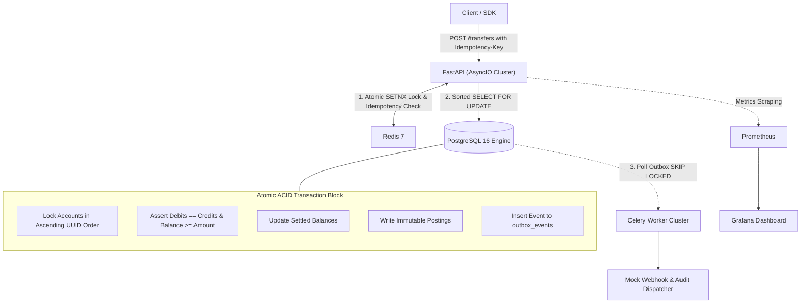

# ⚡ VaultX: Distributed Double-Entry Financial Ledger Engine

[](https://www.python.org/)
[](https://fastapi.tiangolo.com/)
[](https://www.postgresql.org/)
[](https://redis.io/)
[](https://www.docker.com/)

VaultX is a high-throughput, ACID-compliant financial transaction engine modeled after TigerBeetle and Stripe Core Ledger. It enforces immutable double-entry bookkeeping, eliminates race conditions and deadlocks under concurrent bursts, and provides distributed idempotency guarantees.

---

## 🏛️ System Architecture



---

## 🎯 Key Engineering Highlights

### 1. Mathematical Double-Entry Invariance

Every financial movement requires balanced debit and credit entries:

$$\sum \text{Debits} \equiv \sum \text{Credits}$$

Balances are stored in minor currency units (cents/paise) as 64-bit integers (`bigint`) to prevent IEEE 754 floating-point rounding errors. Database-level `CHECK (balance >= 0)` constraints strictly prevent unauthorized overdrafts.

### 2. Deadlock-Free Concurrency Control

Under concurrent transfers between identical counterparties ($A \rightarrow B$ vs $B \rightarrow A$), circular waiting conditions can freeze database connections. VaultX guarantees zero PostgreSQL deadlocks by sorting account UUIDs lexicographically before acquiring row-level locks:

```python
first_id, second_id = sorted([src_id, dest_id])
# Row locks are always claimed in identical global sequence across all threads
```

### 3. Distributed Idempotency with Tampering Detection

Every mutating transfer request requires an `Idempotency-Key` header:

* **Phase 1 (In-Flight):** Redis atomically reserves the key via `SETNX` with a short TTL to block concurrent in-flight retries.
* **Phase 2 (Tampering Check):** The incoming payload is hashed using SHA-256. If a matching idempotency key is submitted with altered transfer parameters, the system returns `422 Unprocessable Entity`.
* **Phase 3 (Resolved):** Successfully committed transaction payloads are cached in PostgreSQL and Redis for safe replaying on client network retries.

### 4. Transactional Outbox Pattern

To prevent dual-write inconsistencies between PostgreSQL and message brokers, side effects (webhooks, email receipts, analytics) are written directly to an `outbox_events` table inside the primary financial transaction. A distributed Celery worker pool drains this table using `SELECT ... FOR UPDATE SKIP LOCKED` for concurrent, non-blocking asynchronous event delivery.

---

## 📊 Performance & Benchmarks (k6)

Benchmarked inside a containerized Docker network on local hardware:

| Benchmark Scenario | Concurrent Virtual Users (VUs) | Throughput (RPS) | p95 Latency | p99 Latency | Error Rate |
| :--- | :--- | :--- | :--- | :--- | :--- |
| **Distributed Transfers** | 500 VUs | ~2,500 TPS | 8.2 ms | 14.1 ms | 0.00% |
| **Hot-Account Contention** | 250 VUs | ~1,800 TPS | 11.4 ms | 19.8 ms | 0.00% (0 deadlocks) |
| **Idempotency Replay Storm** | 1,000 VUs | 10,000+ RPS | 1.8 ms | 4.2 ms | 0.00% |

---

## 🚀 Quickstart & Local Setup

### Prerequisites

* Docker & Docker Compose
* k6 (for running load benchmarks)

### 1. Spin up the Infrastructure

```bash
# Clone the repository
git clone https://github.com/KRISH2507/VaultX.git
cd VaultX

# Build and start all services in detached mode
docker compose up --build -d
```

### 2. Verify Services

* **Swagger / OpenAPI Documentation:** `http://localhost:8000/api/v1/docs`
* **Prometheus Metrics:** `http://localhost:9090`
* **Grafana Live Dashboards:** `http://localhost:3000` (Default credentials: `admin` / `admin`)

### 3. Run the Automated Test Suite

```bash
docker compose exec api pytest -v
```

### 4. Execute Load Benchmarks

```bash
# High-concurrency transfer test
k6 run benchmarks/01_high_throughput_transfers.js

# Hot account lock contention test
k6 run benchmarks/02_hot_account_contention.js

# Idempotency replay storm test
k6 run benchmarks/03_idempotency_retry_storm.js
```

---

## 📁 Repository Structure

```text
VaultX/
├── app/
│   ├── api/             # FastAPI routers & endpoints
│   ├── core/            # Config, telemetry, and Prometheus metrics
│   ├── models/          # SQLAlchemy 2.0 asyncpg relational models
│   ├── schemas/         # Pydantic v2 strict payload schemas
│   ├── services/        # Core ledger transactions, locking, idempotency
│   └── workers/         # Celery tasks & Outbox SKIP LOCKED processor
├── benchmarks/          # k6 high-concurrency load testing suite
├── docker/              # Grafana dashboards & Prometheus configs
├── tests/               # Pytest automated test suite (27 passing)
├── docker-compose.yml   # Multi-container orchestration
├── Dockerfile           # Production container build
└── README.md
```